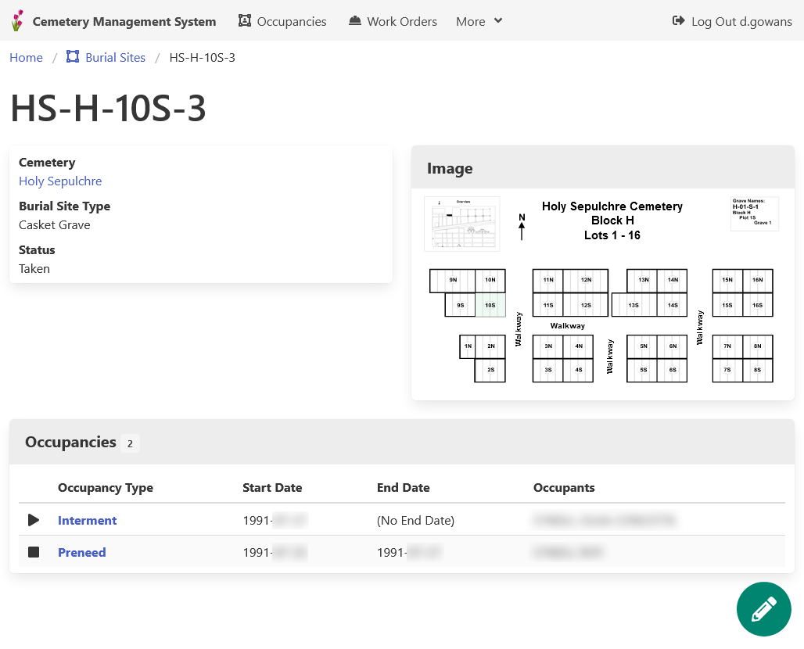

# Lot Occupancy System

**In development**

A system for managing the occupancy of lots.

Built with **cemetery management** in mind, but flexible enough to handle marinas and campgrounds as well.

[**User Documentation**](docs/) (In The Works)

## Key Features

**Maps are optional!** 
Many systems of this type start with a map, and drill down into the data from it.
This can result in a huge amount of effort to get started.
This system can run "out-of-the-box" without maps, with the option to add them when it makes sense.

## About this Project

- [Code of Conduct](CODE_OF_CONDUCT.md)
- [Contributing Guidelines](CONTRIBUTING.md)
- [Security Policy](SECURITY.md)
- [MIT Licence](LICENSE.md)

Although the system is quite niche, it's being released in an open source environment in hopes to pool developer resources from other municipalities looking to move away from older, legacy systems.

It is being shared to start the dialog among other municipalities and present an option to those who may be looking to refresh their own cemetery systems.
