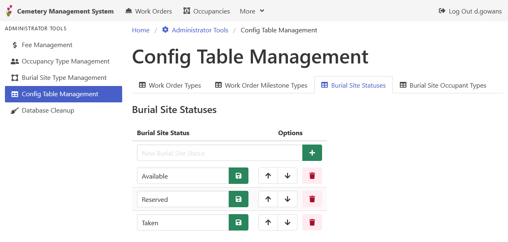

[Home](https://cityssm.github.io/lot-occupancy-system/)
•
[Help](https://cityssm.github.io/lot-occupancy-system/docs/)

# Config Table Management

The Config Table Management page updates simpler configuration tables
that are, for the most part, list-like.

The tables that can be updated on this page include:

-   Work Order Types
-   Work Order Milestone Types
-   Lot Statuses (referred to as "Burial Site Statuses" in the screenshot)
-   Lot Occupant Types (referred to as "Burial Site Occupant Types" in the screenshot)

When updating any list items, it is important not to change the meaning of the items.
When in doubt, rather than renaming a list item, delete it, and create a new one instead.

## Related Links

-   [Occupancy Type Management](adminOccupancyTypes.md)
-   [Lot Type Management](adminLotTypes.md)
