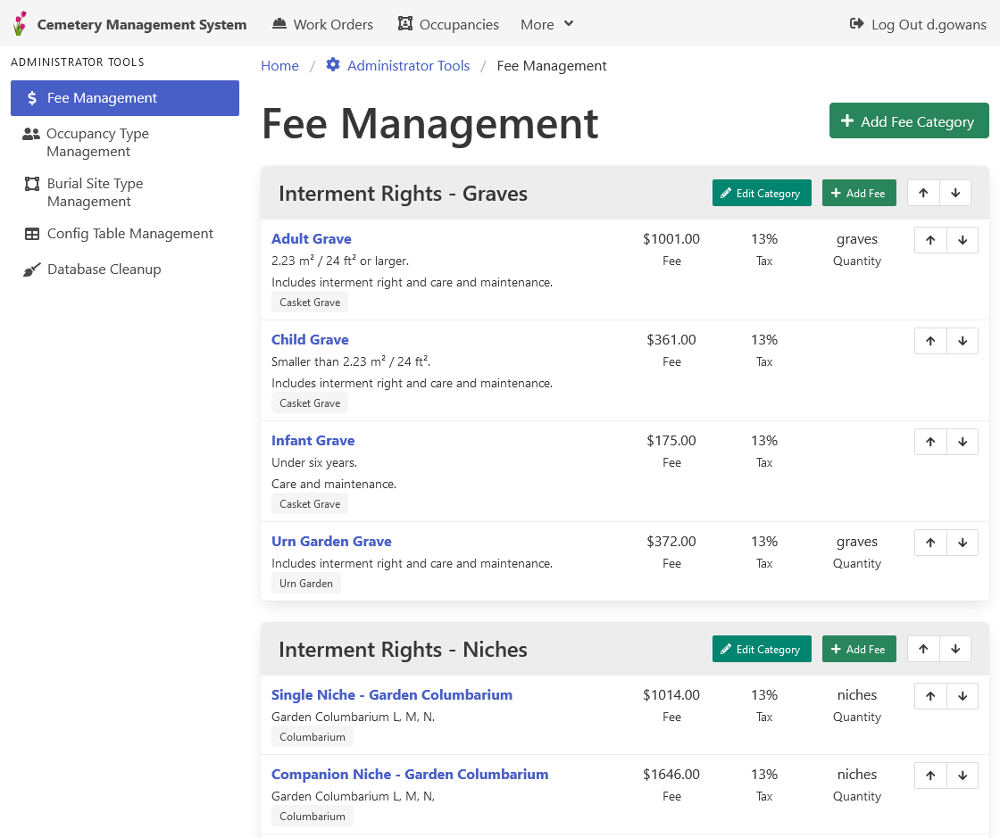

[Home](https://cityssm.github.io/lot-occupancy-system/)
•
[Help](https://cityssm.github.io/lot-occupancy-system/docs/)

# Fee Management

Fees can be applied to [occupancy records](lotOccupancies.md).
Each fee includes the following properties.

- A category, name, and description.
- Filter options by occupancy type and/or lot type.
- Fee and tax amounts.

## Related Links

- [Occupancy Type Management](adminOccupancyTypes.md)
- [Lot Type Management](adminLotTypes.md)
