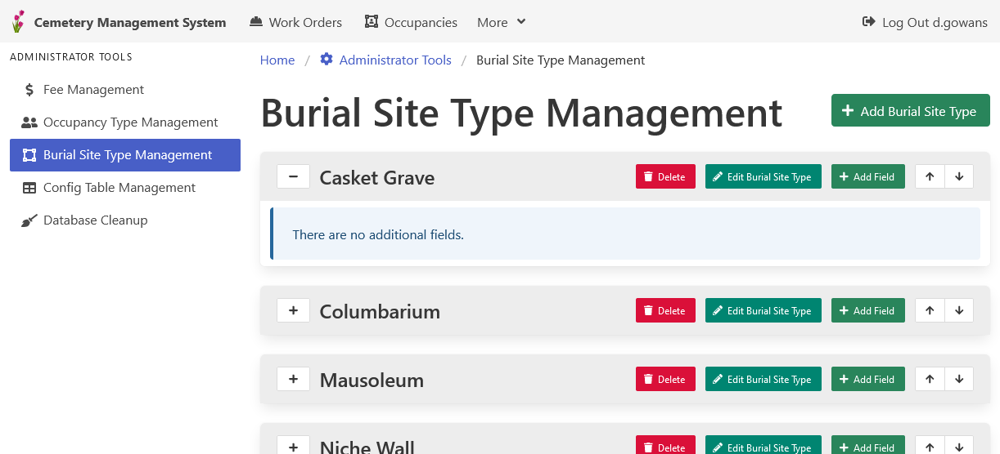

[Home](https://cityssm.github.io/lot-occupancy-system/)
•
[Help](https://cityssm.github.io/lot-occupancy-system/docs/)

# Lot Type Management

Each lot record, refered to as a "burial site" in the screenshot, is assigned a type.
Those types can have custom data fields associated with them.
