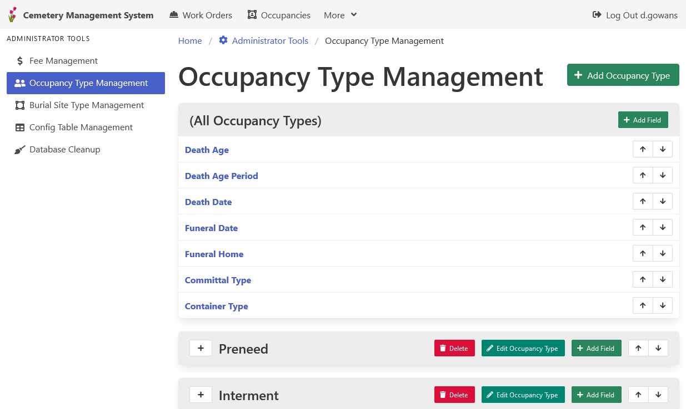

[Home](https://cityssm.github.io/lot-occupancy-system/)
•
[Help](https://cityssm.github.io/lot-occupancy-system/docs/)

# Occupancy Type Management

Each occupancy record is assigned a type.
Those types can have custom data fields associated with them.

## Related Links

-   [Lot Occupancies](lotOccupancies.md)
