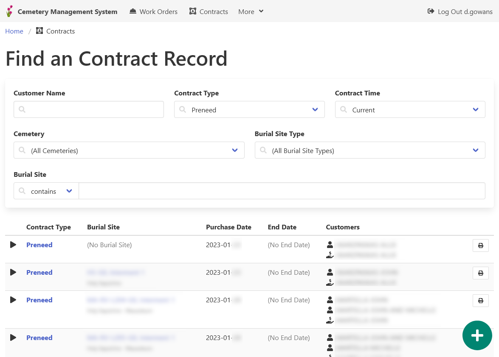
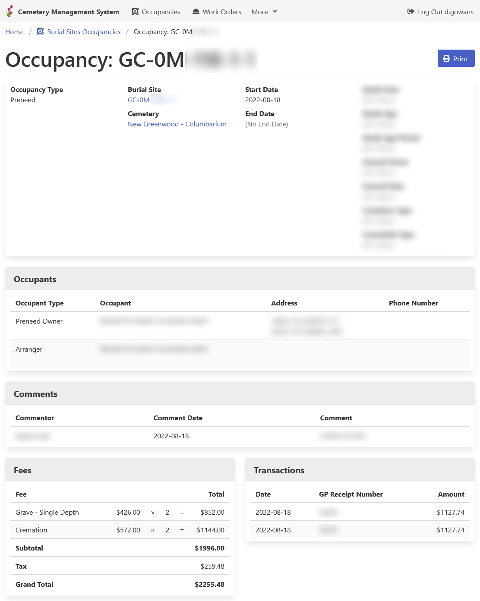

[Home](https://cityssm.github.io/lot-occupancy-system/)
•
[Help](https://cityssm.github.io/lot-occupancy-system/docs/)

# Cemetery Management System Workflow - Newly Deceased

_The following workflow describes a process that can be used when the Lot Occupancy System is used
as a Cemetery Management System._

## Step 1: Search for a Related Preneed Occupancy Record

If the deceased purchased preneed services, find them now.

It is important to note what services have been paid for,
and who is entitled to the services.

## Step 2: Create the New Interment or Cremation Occupancy Record

If a preneed occupancy record exists, you can save time by copying the preneed record as a new record.

If no preneed occupancy record exists, a new occupancy record should be created.

## Step 3: Create a Work Order Associated with the Occupancy Record

Ensure the necessary milestones are included.

## Step 4: Complete the Work Order