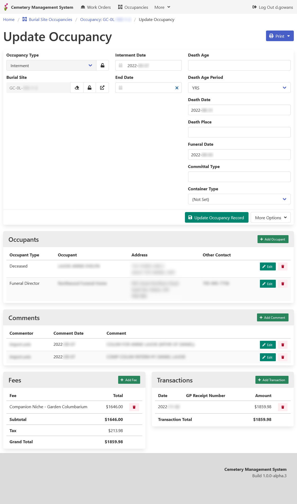
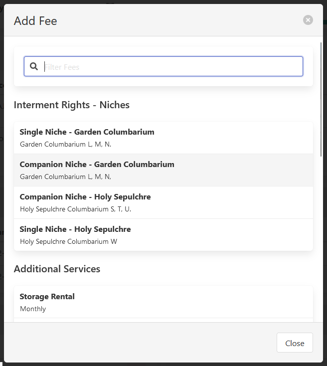

[Home](https://cityssm.github.io/lot-occupancy-system/)
•
[Help](https://cityssm.github.io/lot-occupancy-system/docs/)

# Lot Occupancies

Lot occupancies records track the people who occupy lots.
In the context of a cemetery management system, occupancy records can track the names of
preneed owners or those interred in burial sites.

## Main Details

Occupancy records include the following details.

**Occupancy Type** 
Occupancy types are [completely customizable](adminOccupancyTypes.md),
and can be used to categorize the nature of the occupancy.

**Lot** 
_"Burial Site" in the screenshot._ 
The location where the occupancy is taking place.

**Start Date** 
_"Interment Date" in the screenshot._ 
The date when the lot is considered occupied.

**End Date** 
The date when the lot is no longer considered occupied.

**Additional Fields** 
Additional fields can be added to the occupancy record depending on the selected occupancy type.

## Occupants

Occupancy records can have any number of people associated with them.
In the context of a cemetery management system,
occupants may be preneed owners, funeral directors, or the deceased.
Each occupant can include an occupant type, name, address, phone number, and email address.

## Comments

Comments offer open logging that can track various details that arise throughout the occupancy.

## Fees

Occupancies can have fees associated with them.  The available fees depend on the set occupancy type
and the related lot type.

## Transactions

Transactions are used to pay down applied fees.

## Related Links

-   [Occupancy Type Management](adminOccupancyTypes.md)
-   [Fee Management](adminFees.md)
