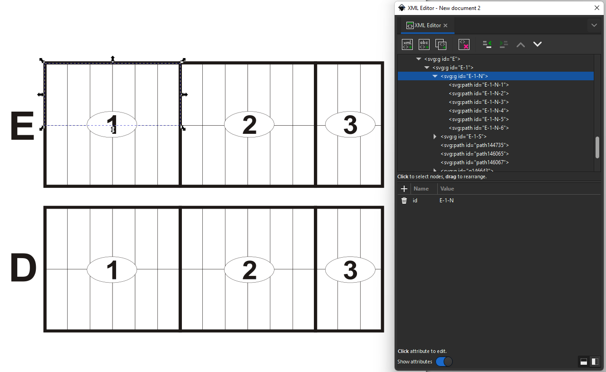
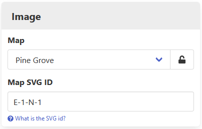

[Home](https://cityssm.github.io/lot-occupancy-system/)
•
[Help](https://cityssm.github.io/lot-occupancy-system/docs/)

# Map Images

Map images rely on SVG (Scalable Vector Graphics) files.

While many SVG editors exist, we recommend [Inkscape](https://inkscape.org/),
a free and open source vector graphics editor.

## Structuring the SVG Files

The SVG format has the ability to group together elements using a `<g>` tag,
and to set an `id` attribute on `<g>` and `<path>` tags.
These two features are heavilty relied on by the Lot Occupancy System.

Take the screenshot above.

- The map has two main sections, D and E.
- Within each section, there are groups 1, 2, and 3.
- Each group has a north side (N) and a south side (S).
- Each side has 3 or 6 lots.

The `id` for the top leftmost lot is `E-1-N-1`.
The `id` for the bottom rightmost lot is `D-3-S-3`.

In order to link the lot record in the application to the lot path in the image,
the `id` attribute of the `<path>` tag should match the Map SVG ID set on the lot record.

Non-exact matching can also be done.  If all lot paths in the SVG image are grouped,
and those groups have their `id` attributes set, the application will for the first matching
path or group, removing pieces from the end of the configured Map SVG ID.

For example, if the application comes across a new lot with Map SVG ID `E-1-N-7`,
there is no exact match.  The application will then look for `E-1-N`,
which will match a group of six lots.  The six lots will be highlighted
until the map is revised with the new lot.

