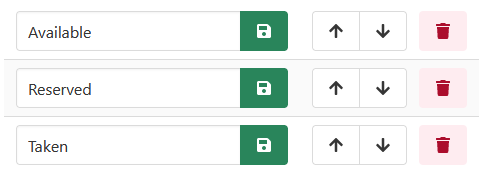

[Home](https://cityssm.github.io/lot-occupancy-system/)
•
[Help](https://cityssm.github.io/lot-occupancy-system/docs/)

# Keyboard Shortcuts

Note that the key combinations needed to access the keyboard shortcuts
vary by browser and operating system.

For example, the Mozilla Firefox web browser running on Windows uses <kbd>Shift</kbd> + <kbd>Alt</kbd>,
while most web browsers running on Mac machines use <kbd>Control</kbd> + <kbd>Option</kbd>.

See [MDN's documentation on the accesskeys](https://developer.mozilla.org/en-US/docs/Web/HTML/Global_attributes/accesskey)
for assistance identifying the combination for your web browser - operating system combination.

## All Pages

| Shortcut Key | Description                          |
| ------------ | ------------------------------------ |
| <kbd>1</kbd> | Go to Work Order search.             |
| <kbd>2</kbd> | Go to Occupancy search.              |
| <kbd>3</kbd> | Go to Lot search.                    |
| <kbd>4</kbd> | Go to Map search.                    |
| <kbd>h</kbd> | Open the Help website.               |
| <kbd>x</kbd> | Log out of the Lot Occupancy System. |

## Search Pages

| Shortcut Key | Description                       |
| ------------ | --------------------------------- |
| <kbd>n</kbd> | Create a new record.              |
| <kbd>f</kbd> | Focus on the first search filter. |

## View Pages

| Shortcut Key                   | Description                               |
| ------------------------------ | ----------------------------------------- |
| <kbd>e</kbd>                   | Switch to edit mode.                      |
| <kbd>,</kbd> (or <kbd><</kbd>) | Move to previous record (when available). |
| <kbd>.</kbd> (or <kbd>></kbd>) | Move to next record (when available).     |

## Edit Pages

| Shortcut Key | Description                        |
| ------------ | ---------------------------------- |
| <kbd>f</kbd> | Focus on the first editable field. |
| <kbd>v</kbd> | Switch to view mode.               |

## Other Shortcuts

### Quick Sorting

Configuration tables with up and down arrow buttons can be reordered one position at a time
by clicking the arrow buttons.

To send an item to the bottom of the list,
hold the <kbd>Shift</kbd> key when clicking the down arrow button.

Similarly, to send an item to the top of the list,
hold the <kbd>Shift</kbd> key when clicking the up arrow button.
